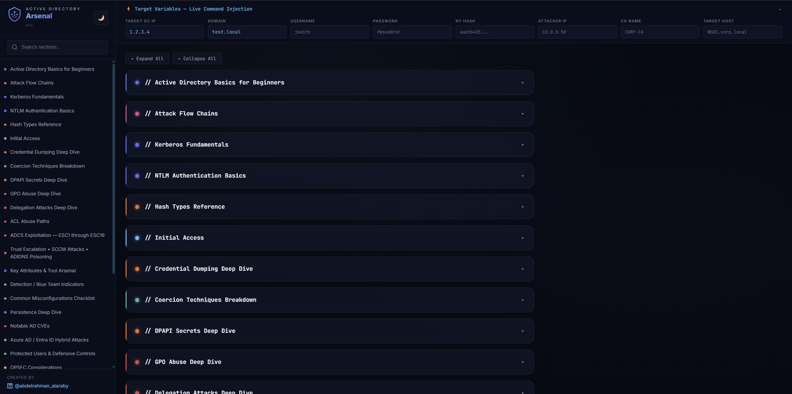
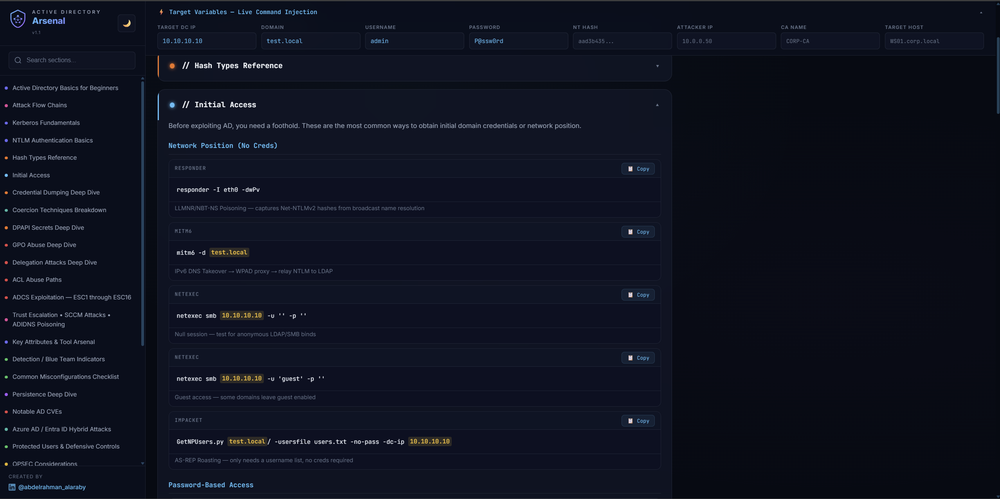

# Active Directory Arsenal

An interactive, self-contained **Active Directory Attack Arsenal** for penetration testing teams. All 31 attack categories with hundreds of ready-to-use commands — fill in your target variables once and every command updates instantly.





## ✨ Features

- **🎯 Live Variable Injection** — Enter your target DC IP, domain, username, password, hash, and attacker IP once. Every command on the page updates in real-time.
- **📋 One-Click Copy** — Every command has a Copy button that copies with your variables already injected.
- **🌗 Light/Dark Theme** — Toggle between dark hacker mode and light mode for readability.
- **🔍 Search & Filter** — Instantly find any technique via the sidebar search.
- **📂 31 Attack Categories** — From initial access to domain dominance, all in one page.
- **🎨 Phase Color-Coding** — Recon (blue), Credential Access (orange), PrivEsc (red), Lateral Movement (teal), Persistence (purple), Domain Dominance (pink).
- **📱 Responsive** — Works on desktop and tablet.
- **⚡ Zero Dependencies** — Pure HTML/CSS/JS. No frameworks, no build steps, no backend.

## 📚 Categories

| # | Section | Phase |
|---|---------|-------|
| 1 | Active Directory Basics | Info |
| 2 | Attack Flow Chains | Info |
| 3 | Kerberos Fundamentals | Recon |
| 4 | NTLM Authentication | Recon |
| 5 | Hash Types Reference | Credential |
| 6 | Initial Access | Recon |
| 7 | Credential Dumping Deep Dive | Credential |
| 8 | Coercion Techniques | Lateral |
| 9 | DPAPI Secrets | Credential |
| 10 | GPO Abuse | PrivEsc |
| 11 | Delegation Attacks | PrivEsc |
| 12 | ACL Abuse Paths (15+ ACE types) | PrivEsc |
| 13 | ADCS ESC1 through ESC16 | PrivEsc |
| 14 | Trust Escalation / SCCM / ADIDNS | Dominance |
| 15 | Key Attributes & Tool Arsenal | Info |
| 16 | Detection / Blue Team Indicators | Defense |
| 17 | Misconfigurations Checklist | Defense |
| 18 | Persistence Deep Dive | Persistence |
| 19 | Notable AD CVEs | PrivEsc |
| 20 | Azure / Entra ID Hybrid Attacks | Lateral |
| 21 | Protected Users & Defenses | Defense |
| 22 | OPSEC | OPSEC |
| 23 | MSSQL Attacks | Lateral |
| 24 | Exchange Attacks | Lateral |
| 25 | Local Privilege Escalation | PrivEsc |
| 26 | Linux in AD Environments | Lateral |
| 27 | AMSI / CLM / AV / EDR Evasion | OPSEC |
| 28 | WSUS Attacks | PrivEsc |
| 29 | gMSA Deep Dive | Credential |
| 30 | Password Cracking Reference | Credential |
| 31 | Additional Techniques | Dominance |

## 🚀 Quick Start

### Option 1: Open Directly
Just double-click `index.html` in your browser.

### Option 2: Local Server
```bash
cd ad-arsenal
python3 -m http.server 8080
# Open http://localhost:8080
```

### Option 3: GitHub Pages
1. Fork this repository
2. Go to **Settings** → **Pages**
3. Set **Source** to `main` branch, folder `/` (root)
4. Click **Save**
5. Your arsenal will be live at `https://yourusername.github.io/ad-arsenal/`

## 🛠️ How to Use

1. Open the Arsenal in your browser
2. Fill in the **Target Variables** bar at the top (DC IP, Domain, Username, Password, Hash, Attacker IP)
3. Browse sections via the sidebar or use search
4. Expand any section to see all commands with your variables already injected
5. Click **📋 Copy** to copy a ready-to-paste command

## 📁 Project Structure

```
ad-arsenal/
├── index.html   # Main page shell
├── style.css    # Design system (dark + light themes)
├── app.js       # Interactive engine
├── data.js      # Sections 1-10
├── data2.js     # Sections 11-22
├── data3.js     # Sections 23-31
├── logo.png     # Arsenal logo
└── README.md    # This file
```

## 📝 Credits

Created by **[@abdelrahman_alaraby](https://www.linkedin.com/in/abdelrahman-alaraby/)**

Content sourced and enhanced from [AD Attack Architecture Map v1.1](https://kypvas.github.io/ad_attack_architecture/)

## ⚠️ Disclaimer

This tool is intended for **authorized penetration testing** and **educational purposes** only. Unauthorized access to computer systems is illegal. Always obtain proper authorization before testing.

## 📄 License

MIT License — Feel free to fork, modify, and share.
